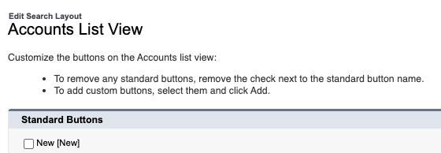
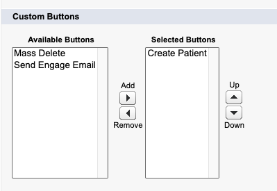
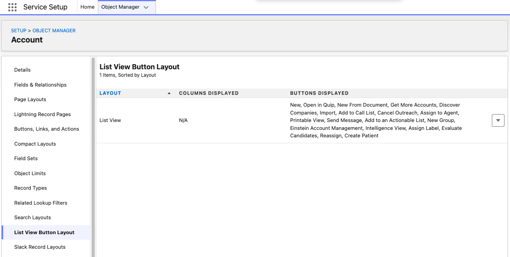
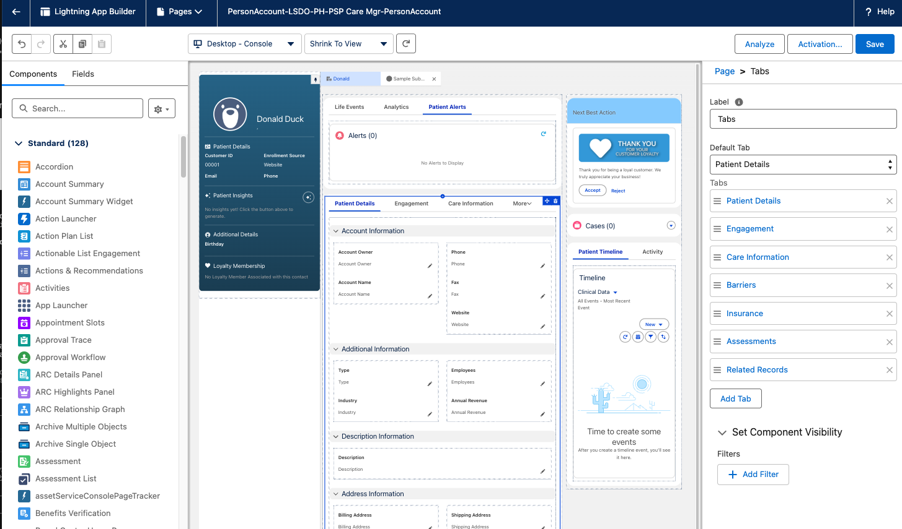
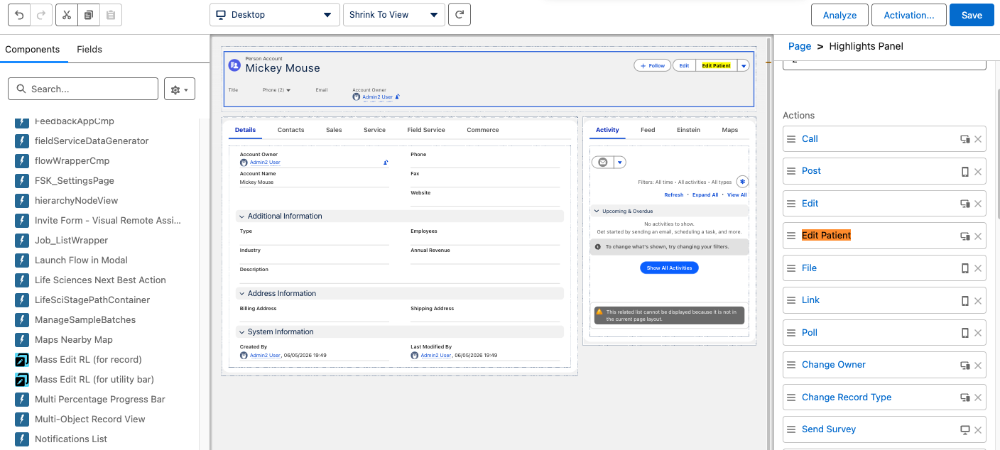

# Create New Patient

## Background

In Life Sciences Cloud, the standard Account "New" button is overridden by a **multi-entity create page** that automatically creates a HealthcareProvider record alongside the Account. Similarly, the standard Edit action uses a multi-entity edit page. This is by design for HCP (Healthcare Provider) workflows.

However, **patients are not healthcare providers**. In orgs where AFLSCE (Agentforce for Life Sciences Commercial Edition) and other applications (e.g., Makana Patient Services, Health Cloud) need to co-exist, creating patients through the multi-entity flow is incorrect — it generates unnecessary HealthcareProvider records for patient accounts.

This project provides a workaround: **dedicated screen flows for creating and editing Patient PersonAccount records** that bypass the multi-entity create/edit entirely. This allows patient management to coexist cleanly alongside HCP workflows in the same org.

## Components

| Component | Type | Description |
|-----------|------|-------------|
| `Create_Patient` | Screen Flow | Creates a new Patient PersonAccount record |
| `Edit_Patient` | Screen Flow | Edits an existing Patient PersonAccount record |
| `Account.Create_Patient` | Quick Action | Launches the Create Patient flow |
| `Account.Edit_Patient` | Quick Action | Launches the Edit Patient flow |
| `Account.Create_Patient` | WebLink (List Button) | "Create Patient" button on Account list view |
| `Account.Patient` | Record Type | Patient record type on Account |

## Flow Diagrams

### Create Patient Flow

```
┌─────────────────────────┐
│         START           │
└────────────┬────────────┘
             │
             ▼
┌─────────────────────────┐
│  Get Patient Record     │
│  Type (PersonAccount)   │
│  ─────────────────────  │
│  Query RecordType where │
│  DeveloperName =        │
│  'PersonAccount'        │
└────────────┬────────────┘
             │
             ▼
┌─────────────────────────┐
│  Patient Information    │
│  Screen                 │
│  ─────────────────────  │
│  • First Name *         │
│  • Last Name *          │
│  • Date of Birth        │
│  • Phone                │
│  • Email                │
└────────────┬────────────┘
             │
             ▼
┌─────────────────────────┐         ┌─────────────────────┐
│  Create Patient Record  │──FAULT──▶│    Error Screen     │
│  ─────────────────────  │         │  Shows error detail  │
│  Account with           │         └─────────────────────┘
│  RecordTypeId =         │
│  PersonAccount          │
└────────────┬────────────┘
             │ SUCCESS
             ▼
┌─────────────────────────┐
│  Confirmation Screen    │
│  ─────────────────────  │
│  "Patient created       │
│   successfully!"        │
└─────────────────────────┘
```

### Edit Patient Flow

```
┌─────────────────────────┐
│     START (recordId)    │
└────────────┬────────────┘
             │
             ▼
┌─────────────────────────┐
│  Get Patient Record     │
│  ─────────────────────  │
│  Query Account by       │
│  recordId, retrieve:    │
│  FirstName, LastName,   │
│  PersonBirthdate,       │
│  Phone, PersonEmail     │
└────────────┬────────────┘
             │
             ▼
┌─────────────────────────┐
│  Edit Patient Screen    │
│  ─────────────────────  │
│  Pre-populated with     │
│  current values:        │
│  • First Name *         │
│  • Last Name *          │
│  • Date of Birth        │
│  • Phone                │
│  • Email                │
└────────────┬────────────┘
             │
             ▼
┌─────────────────────────┐         ┌─────────────────────┐
│  Update Patient Record  │──FAULT──▶│    Error Screen     │
│  ─────────────────────  │         │  Shows error detail  │
│  Updates Account fields │         └─────────────────────┘
└────────────┬────────────┘
             │ SUCCESS
             ▼
┌─────────────────────────┐
│  Confirmation Screen    │
│  ─────────────────────  │
│  "Patient updated       │
│   successfully!"        │
└─────────────────────────┘
```

## Deployment

```bash
sf project deploy start --source-dir force-app --target-org <your-org-alias>
```

## Post-Deployment Setup

### 1. Add "Create Patient" Button to Account List View

The standard "New" button on the Account list view launches a multi-entity create page (Account + HealthcareProvider). Since patients are not healthcare providers, add the "Create Patient" button and optionally remove the "New" button.

1. Go to **Setup > Object Manager > Account > List View Button Layout**
2. Click the dropdown arrow on the List View row and select **Edit**
3. Under **Standard Buttons**, uncheck **New** to remove the multi-entity create button



4. Under **Custom Buttons**, select **Create Patient** from Available Buttons and click **Add** to move it to Selected Buttons



5. Click **Save**



### 2. Add "Edit Patient" Button to Person Account Record Page

> **Important:** The "Edit Patient" action must be added via the **Lightning App Builder**, not the Page Layout editor. Flow-type actions are not supported in the classic page layout editor.

1. Navigate to a Person Account record
2. Click the **gear icon > Edit Page** to open Lightning App Builder

#### If the page has no Highlights Panel

Some record pages (especially Console layouts) may not have a Highlights Panel. You'll know this is the case if you don't see a standard header bar with action buttons at the top of the page:



To add one:

3. In the left **Components** panel, search for **"Highlights Panel"**
4. Drag it to the top of the page layout (above the tabs/content area)
5. Click **Save**

#### Add the Edit Patient action

6. Click on the **Highlights Panel** at the top of the page
7. In the right sidebar under **Actions**, click **Add Action**
8. Search for **"Edit Patient"** and add it to the actions list
9. Click **Save**



## Prerequisites

- Person Accounts must be enabled in the org
- The "Person Account" record type must exist and be active

## Troubleshooting

| Issue | Cause | Fix |
|-------|-------|-----|
| "bad value for restricted picklist field: All" | A trigger sets a picklist value not valid for the record type | Use the `PersonAccount` record type instead of a custom Patient record type |
| Flow action not appearing in page layout editor | Flow actions only work in Lightning App Builder | Use gear icon > Edit Page on a record instead |
| Button not visible on list view | Not added to Search Layout | Setup > Object Manager > Account > Search Layouts > List View |
